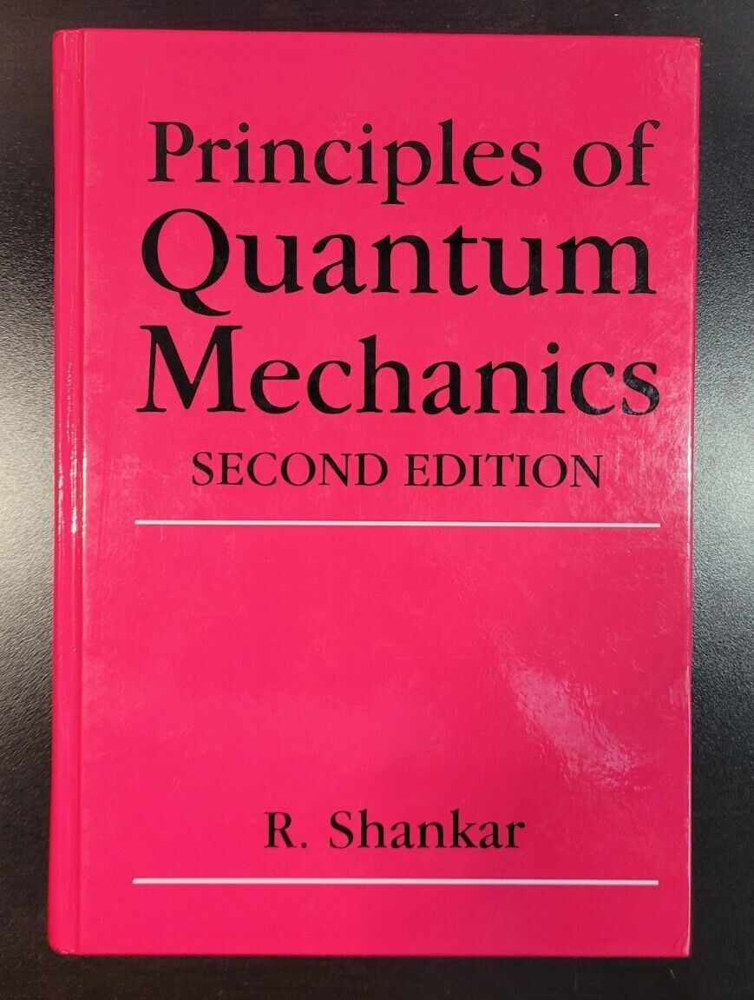

# higgsboson20.github.io
Website for all physics, mathematics, computer science, chemistry, and electrical engineering resources

<html>
<body>

<h1>My First Heading</h1>

 Best QM textbook ever created: 

Cool QM resources:
 
<a href = "https://plato.stanford.edu/entries/qt-quantlog/#QuanProbNuts"> Intensely Rigorous Treatment of Probabilistic QM </a>
 
<a href = "https://sites.astro.caltech.edu/~golwala/ph125ab/ph125_notes_2007.pdf"> Caltech Ph125 Lecture Notes. Follows Directly From Shankar's Text </a>

<a href = "https://archive.nptel.ac.in/content/storage2/courses/122106034/quantumphysics.pdf"> IIT Madras Course on QM (very rigorous) </a>

 
 

  Terraria QOL Mod:
  - Hotkey to switch ammo type
  - Dungeon courtyard (mini-biome in front of the dungeon)
  - Ability to initiate different types of melee attacks (eg: heavy attack, light attack, attack from above, ...)
  - Balance gold... wtf?
  - 
 

</body>
</html>

